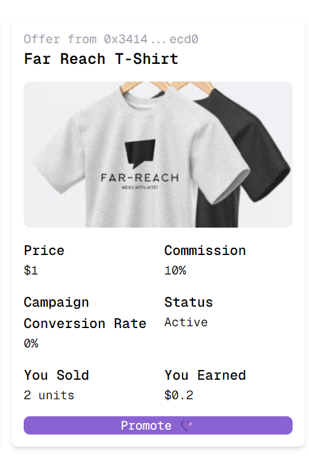

# Far Reach Project

Far-Reach is a Shopify app that connects merchants to the Farcaster ecosystem via affiliates, who sell products to their social graph using Frames. Think Shopify Collabs but for Farcaster and on-chain

## Technologies Used
- React
- GraphQL
- TheGraph
- Airstack
- Privy
- Frames.js
- Base Sepolia
- Smart Wallet
- Gadget
- Shopify

Contract was deployed at: [0xfAA61b73FF67531410D3B535B7c23eE264C7D398](https://sepolia.basescan.org/address/0xfaa61b73ff67531410d3b535b7c23ee264c7d398)

## Receipt NFT

Contract deployed at [0x0620A995e9160C5D6b39b8c586335bE4e38B7391](https://sepolia.basescan.org/address/0x0620a995e9160c5d6b39b8c586335be4e38b7391)

## Here is an example Frame for a product

https://warpcast.com/builderszn.eth/0x364d383c

## Here is the Affiliates WebApp

https://far-reach-5.vercel.app/

# DEMO 

https://www.loom.com/share/7776156054b8436689d6be1d669daa32

## Screenshots

